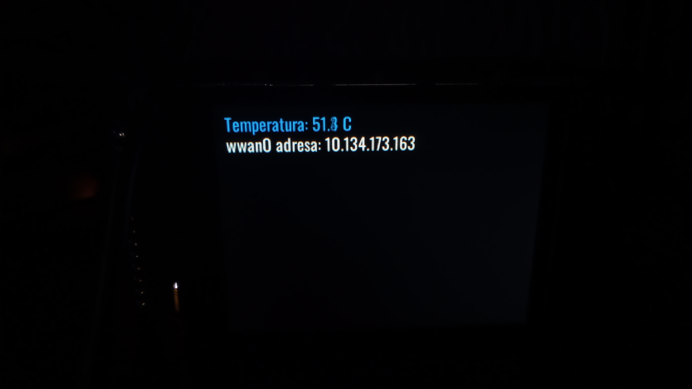

SPI on R4 and SPI display -> https://www.aliexpress.com/item/1005006106418578.html

What you need to modify inside dts is:

        spi@11008000 {
            compatible = "mediatek,mt7988-spi-single", "mediatek,spi-ipm";
            reg = <0x00 0x11008000 0x00 0x100>;
            interrupts = <0x00 0x8d 0x04>;
            clocks = <0x03 0x04 0x03 0x2b 0x0a 0x36 0x0a 0x39>;
            clock-names = "parent-clk", "sel-clk", "spi-clk", "hclk";
            #address-cells = <0x01>;
            #size-cells = <0x00>;
            pinctrl-names = "default";
            pinctrl-0 = <0x15>;
            status = "okay";
            phandle = <0x73>;

            spidev@0 {
                compatible = "rohm,dh2228fv"; /* Koristimo ovaj ID da kernel kreira magistralu */
                reg = <0x00>;
                spi-max-frequency = <24000000>;
            };
        };

and also I found no needs for nand when runnig mmc boot since mmc boot somehow corupts nand so I have disabled nand by this:

        spi@11007000 {
            compatible = "mediatek,mt7988-spi-quad", "mediatek,spi-ipm";
            reg = <0x00 0x11007000 0x00 0x100>;
            interrupts = <0x00 0x8c 0x04>;
            clocks = <0x03 0x04 0x03 0x2a 0x0a 0x35 0x0a 0x38>;
            clock-names = "parent-clk", "sel-clk", "spi-clk", "hclk";
            #address-cells = <0x01>;
            #size-cells = <0x00>;
            status = "disabled";
            pinctrl-names = "default";
            pinctrl-0 = <0x14>;
            phandle = <0x71>;

Enjoy working SPI display example!!! If you need tools for antialiased font and graphic generator all php based here you go -> https://github.com/munjeni/stm32f411_antialiased_fonts Enjoy it too!!
